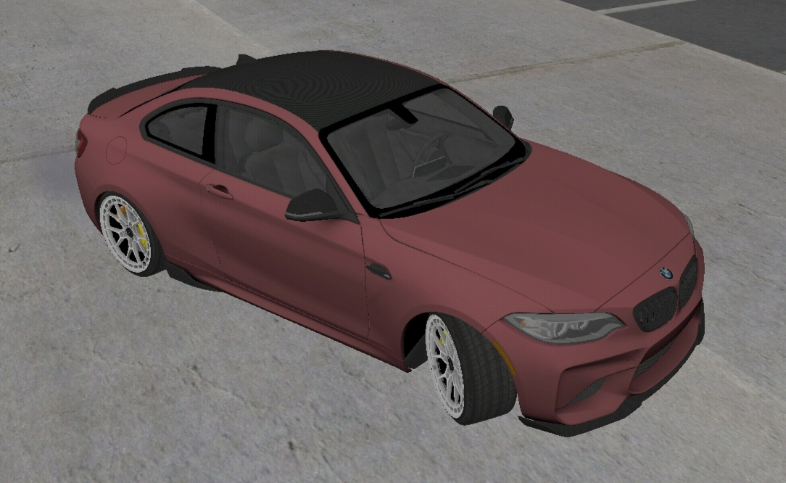

# GTASA No Wheel Turn Back

An Android Modding Library (AML) plugin for *Grand Theft Auto: San Andreas* (Mobile) that patches the steering angle logic, preventing the front wheels from automatically turning back to the center position when you let go of the steering controls.

## Supported Versions
* **GTA SA Android v2.10** (ARM64 / 64-bit)
* **GTA SA Android v2.00** (Thumb-2 / 32-bit)

## Credits
* Spyxxx — Developer
